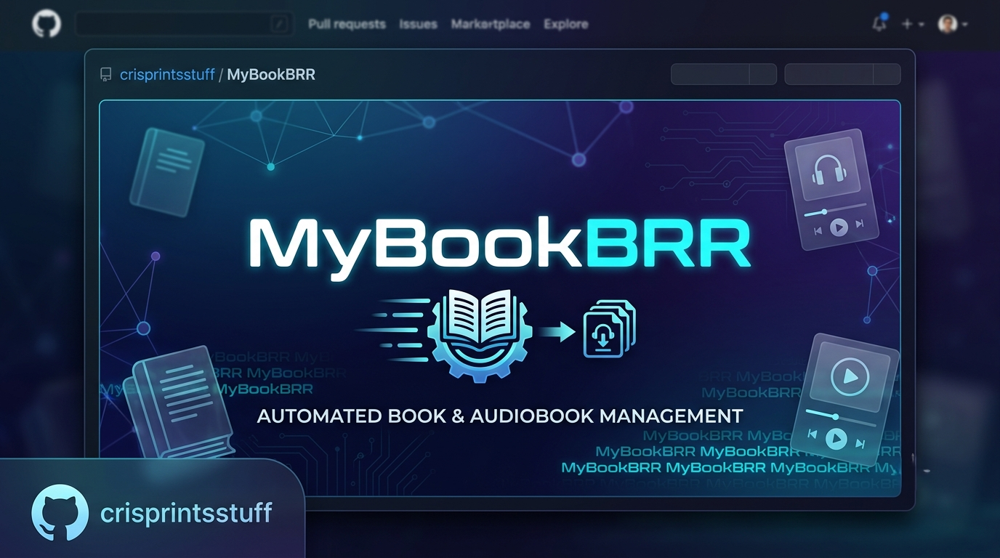

<p align="center">
  
</p>

# MyBookBRR

Self-hosted **MyAnonamouse** auto-downloader in the spirit of [autobrr](https://autobrr.com): **IRC `#announce` snatching**, **wishlist/search polling**, filter rules, and push to **qBittorrent** (or a watch folder).

> For people who already have a MAM account. Not affiliated with MyAnonamouse.

## Features

- Live IRC announce listener (TLS to `irc.myanonamouse.net`)
- Filter rules (authors, series, formats, freeleech, size, regex, daily/weekly limits)
- Wishlist watches that poll MAM JSON search on an interval
- Manual search + one-click snatch
- `mam_id` cookie persistence (use a **dedicated** MAM security session)
- Discord webhooks (stream / errors / snatch)
- Multi-user auth (`admin` / `viewer`) with SQLite sessions
- Optional Discord OAuth and generic OIDC (e.g. Authentik)
- Scoped API keys + `/api/v1` for bots and monitors
- Optional companion Discord bot ([`discord-bot/`](discord-bot/))
- Audit log + settings version history (admin UI)

## Quick start (Docker)

```bash
git clone https://github.com/crisprintsstuff/mybookbrr.git
cd mybookbrr
cp .env.example .env
# set BOOTSTRAP_ADMIN_PASSWORD to something strong
export BOOTSTRAP_ADMIN_PASSWORD='your-secure-password'
docker compose up -d --build
```

Open **http://127.0.0.1:7480** → sign in as `admin` → change password if prompted.

More detail: [DOCKER.md](DOCKER.md).

## Quick start (Node)

Requires **Node 18+** (20/22 recommended).

```bash
cp .env.example .env
# set BOOTSTRAP_ADMIN_PASSWORD
npm install
npm run rebuild:native   # if better-sqlite3 fails to load
npm run build && npm start   # http://127.0.0.1:7480
```

Dev:

```bash
npm run dev          # API :7480
npm run dev:client   # UI :5174 (proxies /api)
```

## First-run checklist

1. Sign in as `admin` with `BOOTSTRAP_ADMIN_PASSWORD`
2. **Connections → MAM & IRC** — paste dedicated `mam_id` → **Test MAM**
3. **Connections → Download client** — qBittorrent host/user/pass → **Test**
4. Create at least one **Filter** (or a match-all with a daily limit)
5. **Dashboard → Start IRC** (and/or add wishlist watches)
6. Optional: Discord webhooks under **Admin → Notifications**
7. Optional: API keys for bots under **Admin → API keys**

## MAM session (important)

1. Log into [MyAnonamouse](https://www.myanonamouse.net/)
2. **Preferences → Security** → create a **new session** only for MyBookBRR
3. Bind the IP of the machine that runs MyBookBRR
4. Copy the `mam_id` cookie into **Connections → MAM & IRC**
5. **Do not** share this session with Autobrr, browser, Prowlarr, etc. — MAM rotates `mam_id` and concurrent clients invalidate each other

Authorize your public IP for IRC under MAM security if `#announce` connections reset.

## Auth model

| Actor | How they authenticate | Access |
|---|---|---|
| Web UI | Username + password; optional Discord OAuth or OIDC | `admin` full control; `viewer` read-only |
| Bots / monitors | `Authorization: Bearer mbb_…` or `X-API-Key` | Scopes per key |

Bootstrap: first start with an empty `users` table creates admin from `BOOTSTRAP_ADMIN_PASSWORD` (or legacy `AUTH_PASSWORD`). Env passwords are not used for day-to-day login after that.

### Discord OAuth (optional)

1. [Discord Developer Portal](https://discord.com/developers/applications) → OAuth2 → Redirects, add e.g.  
   `https://YOUR.DOMAIN/api/auth/discord/callback`
2. Set `DISCORD_CLIENT_ID`, `DISCORD_CLIENT_SECRET`, `DISCORD_REDIRECT_URI`, `DISCORD_ALLOWED_USER_IDS`  
   (or point `DISCORD_AUTH_CONFIG` at a JSON file with `client_id` / `client_secret` / `allowed_user_ids`)
3. Behind HTTPS: `COOKIE_SECURE=true` and `TRUST_PROXY=true`

### OIDC (optional)

Set `OIDC_ENABLED=true` and discovery/client/redirect env vars (see [`.env.example`](.env.example)). Works with Authentik and other standard providers.

### External hub ticket SSO (optional)

If you run a separate control plane that issues one-time tickets, set `SSO_SHARED_SECRET` and `HUB_SSO_REDEEM_URL`. Standalone installs leave these unset.

### “Back to Hub” button (optional)

Build the client with a hub URL if you want a sidebar link:

```bash
VITE_HUB_URL=https://your-hub.example.com npm run build:client
```

Without `VITE_HUB_URL`, the link is hidden.

## Discord bot

Optional control bot: [`discord-bot/`](discord-bot/). Talks to `/api/v1` with an API key. See [discord-bot/README.md](discord-bot/README.md).

## External API (`/api/v1`)

Create keys under **Admin → API keys**. Raw key shown once (`mbb_…`).

### Scopes

| Scope | Access |
|---|---|
| `status:read` | Status + public settings summary |
| `filters:read` / `filters:write` | List / mutate filters |
| `wishlist:read` / `wishlist:write` | List / mutate / run watches |
| `history:read` | Recent snatches |
| `events:read` | Recent events + SSE stream |
| `irc:control` | Start / stop IRC |
| `snatch:write` | Manual snatch |

### Examples

```bash
curl -sS -H "Authorization: Bearer mbb_YOUR_KEY" \
  http://127.0.0.1:7480/api/v1/status

curl -sS -H "X-API-Key: mbb_YOUR_KEY" \
  http://127.0.0.1:7480/api/v1/events
```

UI routes remain under `/api/*` (cookie or API key, role-gated).

## Architecture

```
IRC #announce ─┐
Wishlist poll ─┼→ normalize → filters → dedup → MAM download → qBittorrent
Manual search ─┘
```

Data: `DATA_DIR` (`./data/mybookbrr.db` by default).

## Scripts

| Script | Purpose |
|---|---|
| `npm run dev` | API with hot reload |
| `npm run dev:client` | Vite React UI |
| `npm run build` | Compile server + client |
| `npm start` | Run compiled server |
| `npm run rebuild:native` | Rebuild `better-sqlite3` for current Node |

## Security

See [SECURITY.md](SECURITY.md). Never commit `.env` or `data/`.

## License

[MIT](LICENSE)

## Notes

- IRC uses direct TLS (6697/7000). Starting IRC persists `irc_enabled` across restarts.
- `/api/v1/health` reports liveness + readiness (`mam`, IRC, qBit, lockouts).
- Failed snatches use per-torrent backoff so wishlist polling does not hammer MAM/qBit.
- SQLite backups land in `DATA_DIR/backups/` (default keeps 7).
- CORS defaults to localhost; set `CORS_ORIGINS` for your public origin.
